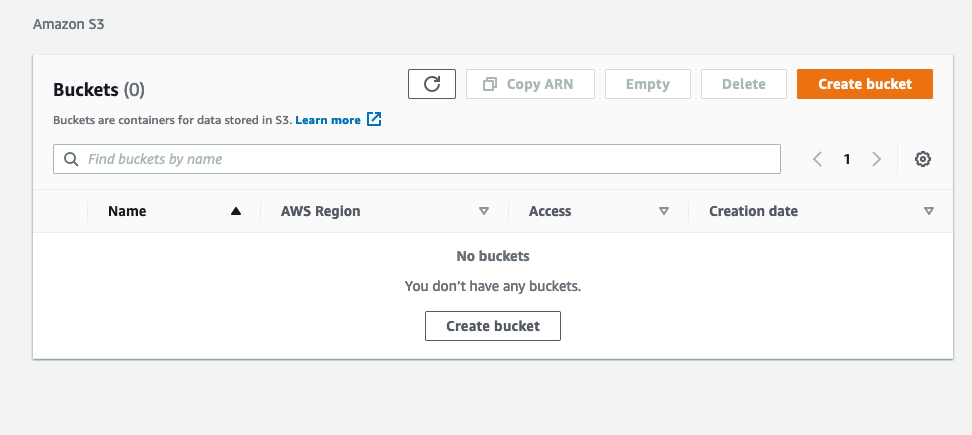
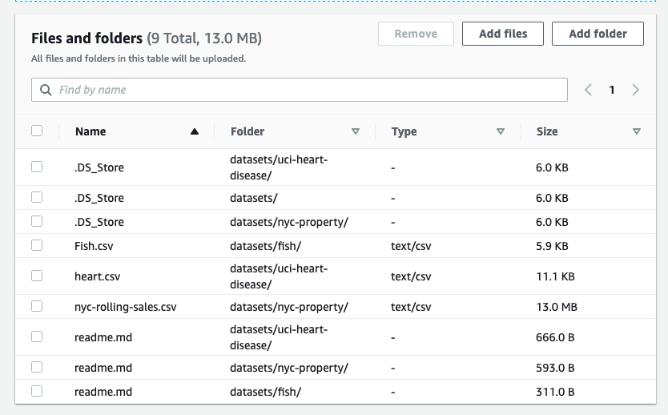
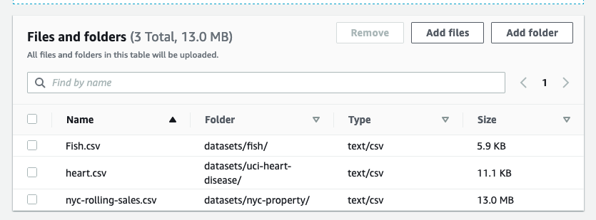

# Using AWS Part 1: Uploading Data

There are many ways to do everything in AWS, this process is just one way to get data into AWS. Alternatives include hosted databases, uploading files directly to a server or virtual server's file system, and more. 

That said, using S3 Buckets makes it fairly easy to share data across many services, and minimize confusion related to specific servers. It is also accessible from so called "serverless" services such as AWS Lambda. 

## AWS S3 Background

* S3 stands for Simple Storage Service.
    * The main unit of S3 is a "bucket" 
    * Buckets are configurable with respect to:
        * Geographic Region (but not a specific server).
        * Read/Write/Access permissions, including public.
        * Accessibility by websites (i.e. Cross-Origin Resource Sharing Configuration)
        * And more...

    * Each bucket is a key-value store.
        * Each object can be up to 5 TB!
        * Objects can be basically kind of data.
        * In our case, we'll upload a CSV.
        * You can also upload folders and subfolders to an S3 bucket, which can be very useful for some types of problem such as image classification.

## Step 1 — Make a Bucket

* Login to AWS and navigate to the S3 Terminal
    * Direct URL for S3: https://console.aws.amazon.com/s3/home

* If you don't have a bucket, create one. 
    * I named mine "mock-ml-datasets".
    * I used the default options and US West region. 

## Step 2 — Add Some Data to the Bucket

* This can be done via the web interface, or the CLI.

* For Web:
    * Click on the new bucket.
    * Click upload.
    * Use the file interface or drag-n-drop your files/folders.
        * For example, I uploaded the entire `datasets` folder from this git repo using the "add folder" option.
        * Make sure you finish by clicking upload at the bottom.

    

    * Double check that you didn't upload things you don't need.
        * For example, I removed the readme.md's and the hidden `.DS_Store` files.

    

## Step 3 — configure CLI

* For CLI
    * First run AWS configure and step through that process.
    * You'll need information about your logins from the AWS User Settings
        * Go to the console home: console.aws.amazon.com/console/home
        * Click IAM, then Users.
        * Pick your user and then click "security credentials" 

* Upload a SSH key is a great option if you're familiar with them.
* If not, the easiest thing to do is create a new access key.
    * MAKE SURE YOU SAVE THE SECRET WHEN YOU MAKE ONE OF THESE.
        * There is no way to access that secret a second time after the key has been created. 

    * run `aws configure` and add the key and secret when promoted.

## Step 4 — Test That The Upload worked via the CLI

* Test it: run `aws s3 ls` 
    * I can see my mock-ml-datasets bucket.

* See the data: `aws s3 ls s3://mock-ml-datasets`
    * I see the folder name, datasets/
    * dig in : `aws s3 ls --recursive s3://mock-ml-datasets/datasets`
    * I see my three files, and their complete filepath.

    